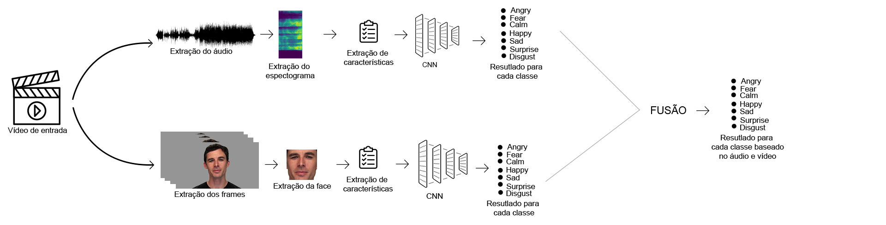
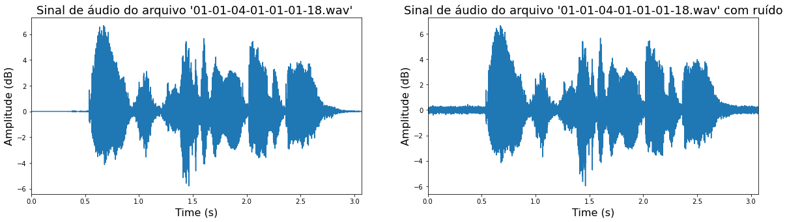
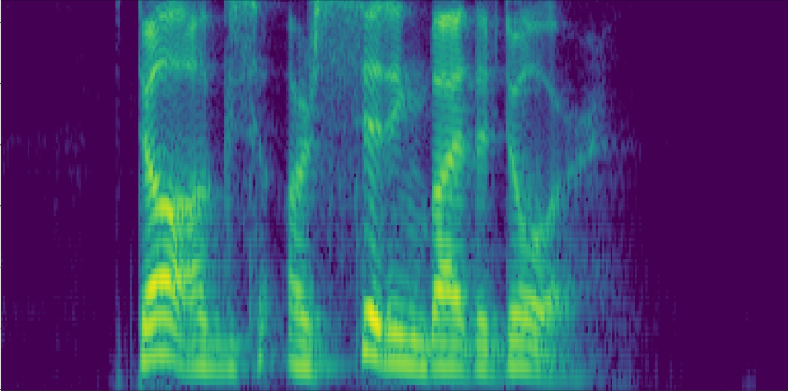
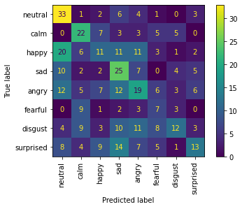

# Analise de emoções atraves de um sistema multimodal

Nossa experiência no mundo é multimodal - vemos objetos, ouvimos sons, cheiramos a odores e sentimos texturas e sabores. D'Mello e Kory (2015) concluíram que sistemas multimodais possuem uma assertividade maior quando comparados a utilização de apenas uma modalidade de representação de dados.
Neste artigo,  apresentamos uma abordagem multimodal para detecção e classificação de emoções, através da análise de modelos do estado da arte para classificação de áudio e vídeo e utilização de redes neurais convolucionais para análise de emoções em áudio, além da estrutura XCeption para reconhecimento de emoções em expressões faciais.
Foi obtido um resultado de 62,2\% sobre os áudios analisados, e uma taxa de acerto de 45\% na análise das expressões faciais.

## Introdução

Uma parte muito importante da interação entre seres humanos é a emoção, e entender o estado emocional de uma pessoa é uma tarefa que vem cada vez mais atraindo atenção de pesquisadores de diferentes áreas da ciência. Os seres humanos demonstram emoções em vários canais, como expressões faciais, fala e gestos, e, quanto mais canais puderem ser analisados, mais precisos são os resultados obtidos.

A aplicação da análise e reconhecimento de emoção dos seres humanos podem ser encontradas em diferentes áreas, como, por exemplo: i) monitoramento de um motorista enquanto dirige seu carro para prever o momento em que o mesmo estará cansado, ajudando a evitar acidentes; ii) no monitoramento de pacientes em depressão, onde o objetivo é ajudar profissionais da área da saúde, como psicólogos no diagnóstico e monitoramento destes pacientes; iii) na análise de candidatos a uma vaga de emprego durante sua entrevista, resultando em uma análise sobre como o candidato estava se sentindo durante momentos chave da entrevista.

O reconhecimento de emoções é uma tarefa muito difícil, com desafios partindo desde o fato de que diferentes seres humanos pode expressar emoções de formas diferentes até a falta de datasets para treinamento de modelos mais precisos. Este trabalho tem como objetivo o desenvolvimento de um modelo de aprendizagem de máquina para análise de emoções através do uso de duas modalidades: o áudio e as expressões facias, além da análise do desempenho de algoritmos de *machine learning* na classificação das bases de dados.

Esta artigo divide-se da seguinte maneira: na seção 2 são mostrados estudos relacionados com reconhecimento de emoções utilizando CNNs e os resultados obtidos. Na seção 3, é apresentado o método proposto para realização deste trabalho, com descrição dos modelos utilizados e características principais. Na seção 4, são mostrados os datasets utilizado para treinamento dos modelos, enquanto que a seção 5  apresentamo os resultados atingidos até o momento. Finalmente, a seção 6 conclui este artigo.

## Trabalhos relacionados

As pesquisas no campo da análise de emoções através da fala e expressões faciais de seres humanos cresce a cada dia.
Diversos estudos visam o reconhecimento de emoções através da análise da fala e algumas outras modalidades, como características faciais, por exemplo. Redes neurais convolucionais (CNNs), modelos *Long Short-Term Memory}(LSTM) e redes neurasi profundas (ou \textit{Deep Belief Networks(DBNs)* são as abordagens que apresentam os melhores resultados.

Um dos melhores resultados para análise de emoções presentes na fala é reportado no artigo *"Speech Emotion Recognition: Features and classification models"*, através do uso de SVMs e correlação de Fisher para remover características redundantes, visto que as carcterísticas foram extraídas das mesmas fontes de áudio, na classificação da base BHUDES (Beihang University Databas of Emotional Speech). Com estas técnicas, foi atingida uma acurácia de 85,6\% na classificação do dataset.

Pan et al., utilizando a combinação de MFCCs, Mel-energy spectrum dynamic coefficientes (MEDCs) e energia através do uso de um classificador SVM em um dataset construído por elem próprio contendo emoções em idioma chinês, conseguiu uma taxa de acerto de 91,3\%. Quando testado no dataset EmoDB, a taxa de acerto foi de 95,1\%, utilizando as mesmas características e o mesmo classificador.

Um dos primeiros trabalhos com fusão de carcterísticas audio-visuais mostrou que um sistema bimodal é mais preciso que um sistema unimodal.

### Reconhecimento de emoções através do áudio

O reconhecimento e classificação de emoções é um dos tópicos mais desafiadores da ciência de dados.
Segundo Ayushi Y. Vadwala, a fala é a mais crucial, conhecida e proeficiente forma de comunicação entre os seres humanos. O estado emocional de uma pessoa escondido em sua fala é um importante fator de interação entre pessoas, uma vez que nos dá feedback sobre a comunicação sem que seja necessário alterar o conteúdo que se está sendo expressado.
Neste artigo, utilizamos três etapas para o reconhecimento das emoções na fala: pre-processamento do sinal de áudio, extração de características e, posteriormente, a classficação.

#### Pre-processamento do sinal

O pre-processamento do sinal, na aprendizagem de máquina,   é uma etapa muito importante que ajuda a melhorar a qualidade dos dados e melhora a extração de características a partir dos dados. Em outras palavras, o pré-processamento é uma técnica que transforma dados brutos para um formato entendível e legível por computadores, ajudando a formatar e organizar esses dados, deixando-os pronto para serem usados em modelos de machine learning. Abaixo, descrevemos cada etapa utilizada no pré-processamento dos sinais de áudio extraídos da base [RAVDESS](https://zenodo.org/record/1188976)

#### Framing
A técnica de framing consiste em dividir um sinal em pequenas janelas, chamadas de frames. Para processamento de fala, geralmente, essa janela varia de 20 milisegundos a 50 milisegundos, com 40\% de sobreposição entre elas.

#### Aumento de dados
De acordo com Daniel Ho, Eric Liang e Richard Liaw (2019), a técnica de aumento de dados é uma estratégia que permite aumentar de forma significativa a diversidade de dados disponíveis para treinamento de modelos, sem coletar novos dados. Além disso, técnicas de aumento de dados ajudam a prevenir overfitting, que acontece quando uma rede aprende de forma muito exata como modelar um conjunto de dados durante o treinamento, mas, posteriormente, falha em prever futuras observações dos dados de forma confiável.

Como técnica de aumento de dados neste trabalho, foi utilizado inserção de ruído no sinal de áudio através de uma relação sinal ruído, uma medida utilizada na engenharia que compara os níveis desejados do sinal com o  nível do ruído de fundo.

Na Figura 3, mostrada abaixo, é possível ver a diferença na onda de sinal de áudio inicial e após o ruído de fundo ser inserido.

#### Extração de espectogramas

Como a extração de características para treinamento do modelo de reconhecimento de emoções em áudio foi realizada sobre os espectogramas dos áudios, fez-se necessário sua extração na fase de pré-processamento do sinal. Nos espectogramas, cores mais escuras mostram a frequência em uma baixa magnitude, enquanto que cores mais claras mostram a frequência em alta magnitude. Segundo O. Abdeil Hamid e A. Mohamed, em seu artigo "Convolutional neural networks for speech recognition" (2014), espectogramas se mostram adequados para uma variedade de análise na fala, incluindo análise de emoções. Uma amostra dos espectogramas extraídos é mostrado na Figura 2.

#### Extração de características

A extração de características é uma das mais importantes fases para o sucesso de qualquer modelo de aprendizagem de máquina. Segundo G. Trigeorgis (2016), uma extração de características apropriada pode contribuir para um melhor treinamento do modelo, enquanto que uma má extração de caracteríticas podem prejudicar significativamente o treinamento do modelo.
Atualmente, CNNs são os modelos do estado da arte para extrair características de alto nível de imagens. Elas utilizam kernels para extrair características, que são usadas no treinamento da CNN para classificação. Uma CNN possui uma arquitetura de três componentes: camada convolucional, que contém alguns filtros que são aplicados a entrada; camadas de pool, que são usados para reduzir a dimensionalidade dos mapas de características. Por último, temos a camada completamente conectada (*fully connected layer*), que extrai as características que são passadas para um classificador SoftMax, retornando a probabilidade para cada classe. 

### Classificadores
Na literatura atual existem diversos classificadores que podem ser utilizados para detecção de emoção na fala. Neste trabalho, foram testados os 3 mais comuns, que são: *Decision Tree*, *Support Vector Machine* e *Randon Forest*. Para este trabalho, foram utilizados como características o *mfcc*, *chroma* e *mel-spectogram*. Todos os três classificadores foram treinados utilizando os mesmos dados de entrada, sendo 1004 áudios para treinamento e 431 reservados para teste, em uma proporção de 70\% e 30\%, respectivamente.

#### Árvores de decisão
Árvores de decisão são um método de aprendizado não parametrico utilizado para classificação e regressão. Elas dividem um conjunto de dados em subconjuntos cada vez menores de forma recursiva, enquanto que ao mesmo tempo uma árvore de decisão associada é desenvolvida de forma incremental, resultando em uma árvore com nós de decisão e nós folha, onde nó folha representa uma classificação ou decisão daquela árvore. Durante a execução dos testes, a árvore de decisão foi o algoritmo que aprensentou o pior resultado, com uma acurácia de 32,94\%. A matriz de confusão para a árvore de decisão utilizada pode ser vista na Figura 4. Podemos perceber que para este classificador, as maiores confusões ocorrem entre surpresa e tristeza, além de tristeza e raiva. Classes com uma maior distinção entre si, como felicidade e tristeza, por exemplo, apresentam uma taxa de confusão menor.

